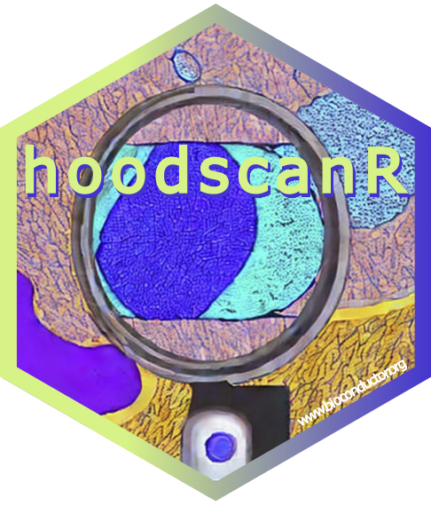

# hoodscanR: Cellular neighborhoods scanning from spatial transcriptomics data in R 

[](https://github.com/DavisLaboratory/hoodscanR/actions)


Install development version from GitHub

```
library(devtools)
devtools::install_github("DavisLaboratory/hoodscanR")
```


