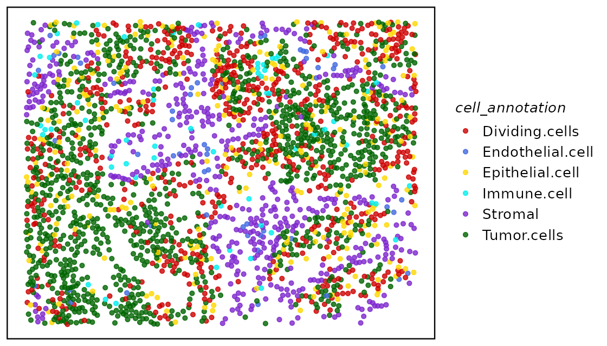
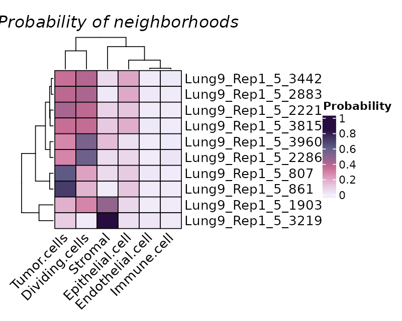
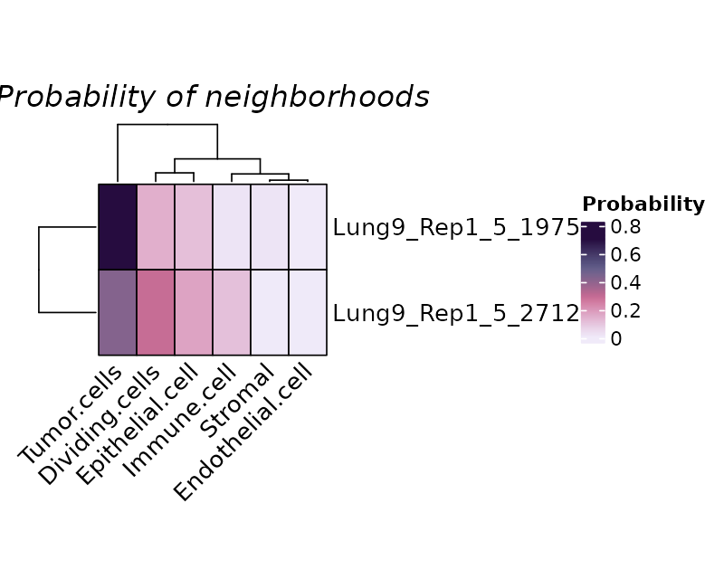
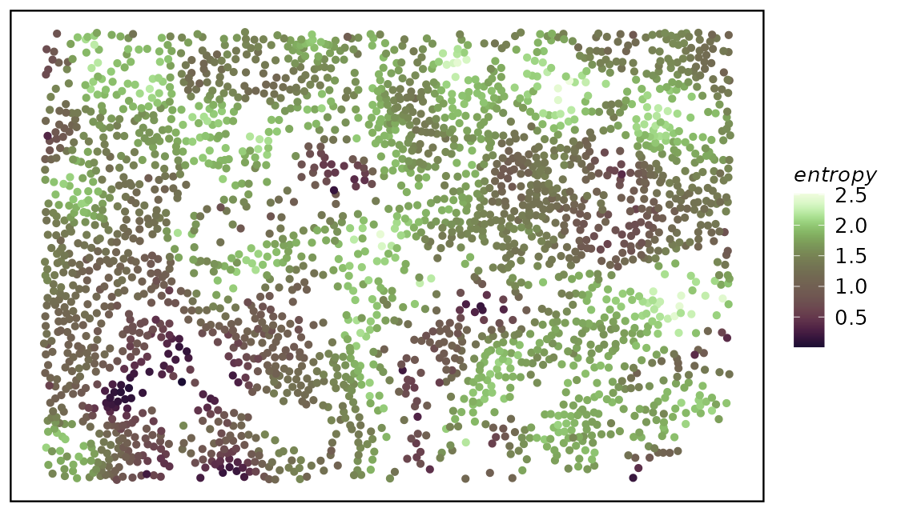
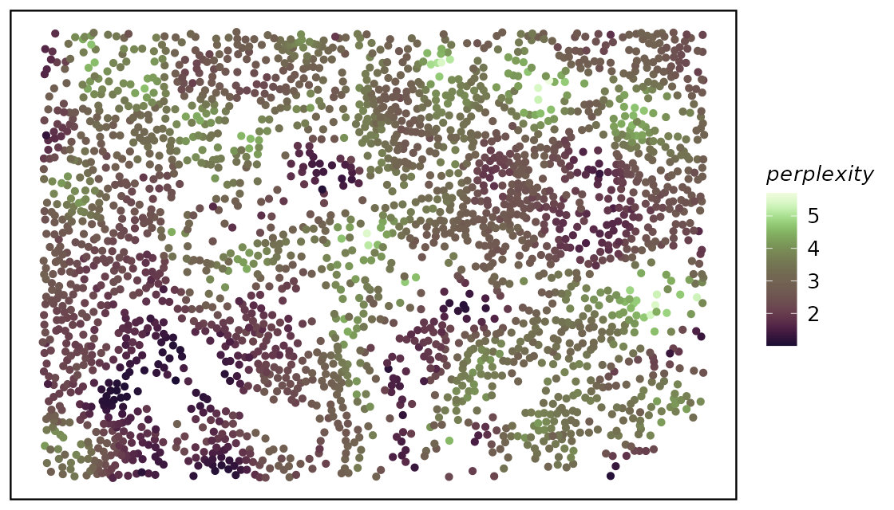
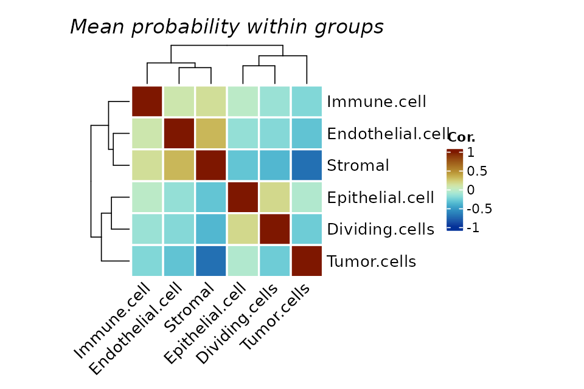
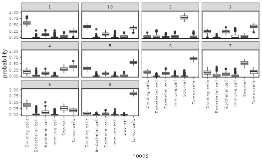
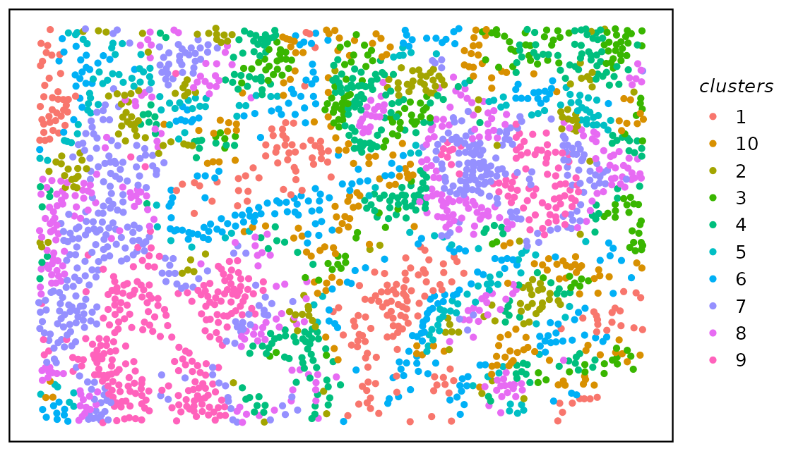

# A quick start guide to the hoodscanR package

## Introduction

hoodscanR is an user-friendly R package providing functions to assist
cellular neighborhood analysis of any spatial transcriptomics data with
single-cell resolution.

All functions in the package are built based on the
*[SpatialExperiment](https://bioconductor.org/packages/3.22/SpatialExperiment)*
infrastructure, allowing integration into various spatial
transcriptomics-related packages from Bioconductor. The package can
result in cell-level neighborhood annotation output, along with funtions
to perform neighborhood colocalization analysis and neighborhood-based
cell clustering.

## Installation

``` r
if (!require("BiocManager", quietly = TRUE)) {
  install.packages("BiocManager")
}

BiocManager::install("hoodscanR")
```

The development version of `hoodscanR` can be installed from GitHub:

``` r
devtools::install_github("DavisLaboratory/hoodscanR")
```

## Quick start

``` r
suppressPackageStartupMessages({
  library(SummarizedExperiment)
  library(SingleCellExperiment)
  library(SpatialExperiment)
})

library(hoodscanR)
library(SpatialExperiment)
library(scico)
```

## Data exploration

The `readHoodData` function can format the spatialExperiment input
object as desired for all other functions in the `hoodscanR` package.

``` r
data("spe_test")

spe <- readHoodData(spe, anno_col = "celltypes")
```

``` r
spe
```

    ## class: SpatialExperiment 
    ## dim: 50 2661 
    ## metadata(1): dummy
    ## assays(1): counts
    ## rownames(50): MERTK MRC1 ... SAA2 FZD4
    ## rowData names(0):
    ## colnames(2661): Lung9_Rep1_5_5 Lung9_Rep1_5_6 ... Lung9_Rep1_5_4047
    ##   Lung9_Rep1_5_4052
    ## colData names(9): orig.ident nCount_RNA ... cell_annotation sample_id
    ## reducedDimNames(0):
    ## mainExpName: NULL
    ## altExpNames(0):
    ## spatialCoords names(2) : x y
    ## imgData names(0):

``` r
colData(spe)
```

    ## DataFrame with 2661 rows and 9 columns
    ##                   orig.ident nCount_RNA nFeature_RNA       fov      Area
    ##                     <factor>  <numeric>    <integer> <integer> <integer>
    ## Lung9_Rep1_5_5         Lung9        182          104         5      4377
    ## Lung9_Rep1_5_6         Lung9        447          214         5      4678
    ## Lung9_Rep1_5_7         Lung9        234          148         5      2236
    ## Lung9_Rep1_5_8         Lung9        118           69         5      4781
    ## Lung9_Rep1_5_14        Lung9        424          235         5      4385
    ## ...                      ...        ...          ...       ...       ...
    ## Lung9_Rep1_5_4040      Lung9         84           65         5      1720
    ## Lung9_Rep1_5_4041      Lung9        153          105         5      3418
    ## Lung9_Rep1_5_4045      Lung9         48           42         5      1735
    ## Lung9_Rep1_5_4047      Lung9         50           41         5      2101
    ## Lung9_Rep1_5_4052      Lung9         48           42         5       977
    ##                   AspectRatio       slide cell_annotation   sample_id
    ##                     <numeric> <character>     <character> <character>
    ## Lung9_Rep1_5_5           1.15  Lung9_Rep1     Tumor.cells    sample01
    ## Lung9_Rep1_5_6           0.98  Lung9_Rep1     Tumor.cells    sample01
    ## Lung9_Rep1_5_7           1.29  Lung9_Rep1     Tumor.cells    sample01
    ## Lung9_Rep1_5_8           1.74  Lung9_Rep1         Stromal    sample01
    ## Lung9_Rep1_5_14          1.11  Lung9_Rep1     Tumor.cells    sample01
    ## ...                       ...         ...             ...         ...
    ## Lung9_Rep1_5_4040        0.87  Lung9_Rep1 Epithelial.cell    sample01
    ## Lung9_Rep1_5_4041        2.89  Lung9_Rep1  Dividing.cells    sample01
    ## Lung9_Rep1_5_4045        1.45  Lung9_Rep1     Tumor.cells    sample01
    ## Lung9_Rep1_5_4047        2.97  Lung9_Rep1 Epithelial.cell    sample01
    ## Lung9_Rep1_5_4052        2.22  Lung9_Rep1 Epithelial.cell    sample01

We can have a look at the tissue and cell positions by using the
function `plotTissue`.

The test data is relatively sparse with low-level cell type annotations.

``` r
col.pal <- c("red3", "royalblue", "gold", "cyan2", "purple3", "darkgreen")

plotTissue(spe, color = cell_annotation, size = 1.5, alpha = 0.8) +
  scale_color_manual(values = col.pal)
```



## Neighborhoods scanning

In order to perform neighborhood scanning, we need to firstly identify k
(in this example, k = 100) nearest cells for each cells. The searching
algorithm is based on Approximate Near Neighbor (ANN) C++ library from
the RANN package.

``` r
fnc <- findNearCells(spe, k = 100)
```

The output of `findNearCells` function includes two matrix, an
annotation matrix and a distance matrix.

``` r
lapply(fnc, function(x) x[1:10, 1:5])
```

    ## $cells
    ##                 nearest_cell_1 nearest_cell_2  nearest_cell_3 nearest_cell_4
    ## Lung9_Rep1_5_5     Tumor.cells    Tumor.cells     Tumor.cells    Tumor.cells
    ## Lung9_Rep1_5_6     Tumor.cells    Tumor.cells     Tumor.cells    Tumor.cells
    ## Lung9_Rep1_5_7     Tumor.cells    Tumor.cells     Tumor.cells Dividing.cells
    ## Lung9_Rep1_5_8         Stromal Dividing.cells Epithelial.cell        Stromal
    ## Lung9_Rep1_5_14    Tumor.cells    Tumor.cells  Dividing.cells Dividing.cells
    ## Lung9_Rep1_5_15    Tumor.cells    Tumor.cells     Tumor.cells Dividing.cells
    ## Lung9_Rep1_5_18        Stromal        Stromal Epithelial.cell        Stromal
    ## Lung9_Rep1_5_21    Tumor.cells    Tumor.cells     Tumor.cells    Tumor.cells
    ## Lung9_Rep1_5_22 Dividing.cells    Tumor.cells     Tumor.cells    Tumor.cells
    ## Lung9_Rep1_5_25        Stromal        Stromal         Stromal        Stromal
    ##                 nearest_cell_5
    ## Lung9_Rep1_5_5     Tumor.cells
    ## Lung9_Rep1_5_6     Tumor.cells
    ## Lung9_Rep1_5_7     Tumor.cells
    ## Lung9_Rep1_5_8  Dividing.cells
    ## Lung9_Rep1_5_14    Tumor.cells
    ## Lung9_Rep1_5_15    Tumor.cells
    ## Lung9_Rep1_5_18    Tumor.cells
    ## Lung9_Rep1_5_21 Dividing.cells
    ## Lung9_Rep1_5_22    Tumor.cells
    ## Lung9_Rep1_5_25        Stromal
    ## 
    ## $distance
    ##                 nearest_cell_1 nearest_cell_2 nearest_cell_3 nearest_cell_4
    ## Lung9_Rep1_5_5        89.89994      124.91997      145.38225      157.13688
    ## Lung9_Rep1_5_6        43.41659       77.52419       84.97058       89.02247
    ## Lung9_Rep1_5_7        43.41659       48.04165       97.00000      109.98636
    ## Lung9_Rep1_5_8        64.40497      166.92813      202.35612      206.20621
    ## Lung9_Rep1_5_14       71.80529       77.31753      115.20851      125.29964
    ## Lung9_Rep1_5_15       56.08921      105.75916      108.66922      112.78741
    ## Lung9_Rep1_5_18       99.80982      181.68654      186.81542      189.44656
    ## Lung9_Rep1_5_21       46.09772       81.56592       86.57944       99.32271
    ## Lung9_Rep1_5_22       29.73214       43.01163       49.64877       67.06713
    ## Lung9_Rep1_5_25       87.70975      158.91193      181.03315      205.38014
    ##                 nearest_cell_5
    ## Lung9_Rep1_5_5        158.6852
    ## Lung9_Rep1_5_6        101.4347
    ## Lung9_Rep1_5_7        120.9339
    ## Lung9_Rep1_5_8        228.7204
    ## Lung9_Rep1_5_14       129.0349
    ## Lung9_Rep1_5_15       143.0035
    ## Lung9_Rep1_5_18       220.7374
    ## Lung9_Rep1_5_21       108.4066
    ## Lung9_Rep1_5_22        69.8570
    ## Lung9_Rep1_5_25       276.8267

We can then perform neighborhood analysis using the function
`scanHoods`. This function incldue the modified softmax algorithm,
aimming to genereate a matrix with the probability of each cell
associating with their 100 nearest cells.

``` r
pm <- scanHoods(fnc$distance)
```

The resulting

``` r
pm[1:10, 1:5]
```

    ##                 nearest_cell_1 nearest_cell_2 nearest_cell_3 nearest_cell_4
    ## Lung9_Rep1_5_5      0.18304483     0.13150067     0.10311690     0.08819389
    ## Lung9_Rep1_5_6      0.11420320     0.09526285     0.09032795     0.08757140
    ## Lung9_Rep1_5_7      0.13475921     0.13227645     0.09680770     0.08601822
    ## Lung9_Rep1_5_8      0.44211502     0.15585801     0.08768955     0.08183066
    ## Lung9_Rep1_5_14     0.09572989     0.09233235     0.06700040     0.06022003
    ## Lung9_Rep1_5_15     0.17384013     0.12208690     0.11878336     0.11411524
    ## Lung9_Rep1_5_18     0.41139452     0.14935678     0.13744881     0.13159514
    ## Lung9_Rep1_5_21     0.09624026     0.07886930     0.07599996     0.06848324
    ## Lung9_Rep1_5_22     0.08024218     0.07690592     0.07485455     0.06845482
    ## Lung9_Rep1_5_25     0.44586128     0.20603613     0.14803730     0.09789334
    ##                 nearest_cell_5
    ## Lung9_Rep1_5_5      0.08631823
    ## Lung9_Rep1_5_6      0.07892756
    ## Lung9_Rep1_5_7      0.07697076
    ## Lung9_Rep1_5_8      0.05320675
    ## Lung9_Rep1_5_14     0.05775686
    ## Lung9_Rep1_5_15     0.08124211
    ## Lung9_Rep1_5_18     0.07485027
    ## Lung9_Rep1_5_21     0.06303149
    ## Lung9_Rep1_5_22     0.06731485
    ## Lung9_Rep1_5_25     0.02152751

We can then merge the probabilities by the cell types of the 100 nearest
cells.

``` r
hoods <- mergeByGroup(pm, fnc$cells)
```

Now we have the final probability distribution of each cell all each
neighborhood.

``` r
hoods[1:10, ]
```

    ##                 Dividing.cells Endothelial.cell Epithelial.cell  Immune.cell
    ## Lung9_Rep1_5_5     0.006003838     3.564371e-04    1.063262e-05 3.133032e-02
    ## Lung9_Rep1_5_6     0.206692970     5.075441e-06    1.381476e-02 4.447312e-07
    ## Lung9_Rep1_5_7     0.263126690     9.512496e-07    2.015171e-02 6.336489e-08
    ## Lung9_Rep1_5_8     0.216159266     1.481687e-06    1.337012e-01 3.953512e-09
    ## Lung9_Rep1_5_14    0.174747009     7.946121e-03    1.972819e-03 9.591948e-06
    ## Lung9_Rep1_5_15    0.117429056     4.244536e-04    6.713550e-04 2.374688e-03
    ## Lung9_Rep1_5_18    0.024023243     4.349856e-06    1.376427e-01 1.394815e-07
    ## Lung9_Rep1_5_21    0.206271880     4.045150e-04    5.811456e-02 0.000000e+00
    ## Lung9_Rep1_5_22    0.218030798     5.962029e-03    2.615948e-02 2.456481e-07
    ## Lung9_Rep1_5_25    0.014854723     4.151471e-07    9.489670e-04 0.000000e+00
    ##                      Stromal Tumor.cells
    ## Lung9_Rep1_5_5  0.000000e+00 0.962298768
    ## Lung9_Rep1_5_6  0.000000e+00 0.779486754
    ## Lung9_Rep1_5_7  0.000000e+00 0.716720587
    ## Lung9_Rep1_5_8  5.802381e-01 0.069899943
    ## Lung9_Rep1_5_14 2.589378e-05 0.815298565
    ## Lung9_Rep1_5_15 0.000000e+00 0.879100448
    ## Lung9_Rep1_5_18 7.565452e-01 0.081784355
    ## Lung9_Rep1_5_21 1.453902e-01 0.589818860
    ## Lung9_Rep1_5_22 2.321371e-03 0.747526073
    ## Lung9_Rep1_5_25 9.774651e-01 0.006730819

## Neighborhoods analysis

We plot randomly plot 10 cells to see the output of neighborhood
scanning using `plotHoodMat`. In this plot, each value represent the
probability of the each cell (each row) located in each cell type
neighborhood. The rowSums of the probability maxtrix will always be 1.

``` r
plotHoodMat(hoods, n = 10, hm_height = 5)
```



Or to check the cells-of-interest with the parameter `targetCells`
within the function

``` r
plotHoodMat(hoods, targetCells = c("Lung9_Rep1_5_1975", "Lung9_Rep1_5_2712"), hm_height = 3)
```



We can then merge the neighborhood results with the SpatialExperiment
object using `mergeHoodSpe` so that we can conduct more
neighborhood-related analysis.

``` r
spe <- mergeHoodSpe(spe, hoods)
```

To summarise our neighborhood results, we can use `calcMetrics` to
calculate entropy and perplexity of the probability matrix so that we
can have a summarisation of the neighborhood distribution across the
tissue slide, i.e. where neighborhood is more distinct and where is more
mixed.

``` r
spe <- calcMetrics(spe, pm_cols = colnames(hoods))
```

We then again use `plotTissue` to plot out the entropy or perplexity.

While both entropy and perplexity measure the mixture of neighborhood of
each cell, perplexity can be more intuitive for the human mind as the
value of it actually mean something. For example, perplexity of 1 means
the cell is located in a very distinct neighborhood, perplexity of 2
means the cell is located in a mixed neighborhood, and the probability
is about 50% to 50%.

``` r
plotTissue(spe, size = 1.5, color = entropy) +
  scale_color_scico(palette = "tokyo")
```



``` r
plotTissue(spe, size = 1.5, color = perplexity) +
  scale_color_scico(palette = "tokyo")
```



We can perform neighborhood colocalization analysis using `plotColocal`.
This function compute pearson correlation on the probability
distribution of each cell. Here we can see in the test data, endothelial
cells and stromal cells are more likely to colocalize, epithelial cells
and dividing cells are more likely to colocalize.

``` r
plotColocal(spe, pm_cols = colnames(hoods))
```



We can cluster the cells by their neighborhood probability distribution
using `clustByHood`, it is based on the k-means algorithm and here we
set k to 10.

``` r
spe <- clustByHood(spe, pm_cols = colnames(hoods), k = 10)
```

We can see what are the neighborhood distributions look like in each
cluster using `plotProbDist`.

``` r
plotProbDist(spe, pm_cols = colnames(hoods), by_cluster = TRUE, plot_all = TRUE, show_clusters = as.character(seq(10)))
```



We can plot the clusters on the tissue slide, agian using `plotTissue`.

``` r
plotTissue(spe, color = clusters)
```



## Session info

``` r
sessionInfo()
```

    ## R version 4.5.2 (2025-10-31)
    ## Platform: x86_64-pc-linux-gnu
    ## Running under: Ubuntu 24.04.3 LTS
    ## 
    ## Matrix products: default
    ## BLAS:   /usr/lib/x86_64-linux-gnu/openblas-pthread/libblas.so.3 
    ## LAPACK: /usr/lib/x86_64-linux-gnu/openblas-pthread/libopenblasp-r0.3.26.so;  LAPACK version 3.12.0
    ## 
    ## locale:
    ##  [1] LC_CTYPE=C.UTF-8       LC_NUMERIC=C           LC_TIME=C.UTF-8       
    ##  [4] LC_COLLATE=C.UTF-8     LC_MONETARY=C.UTF-8    LC_MESSAGES=C.UTF-8   
    ##  [7] LC_PAPER=C.UTF-8       LC_NAME=C              LC_ADDRESS=C          
    ## [10] LC_TELEPHONE=C         LC_MEASUREMENT=C.UTF-8 LC_IDENTIFICATION=C   
    ## 
    ## time zone: UTC
    ## tzcode source: system (glibc)
    ## 
    ## attached base packages:
    ## [1] stats4    stats     graphics  grDevices utils     datasets  methods  
    ## [8] base     
    ## 
    ## other attached packages:
    ##  [1] scico_1.5.0                 hoodscanR_1.7.2            
    ##  [3] SpatialExperiment_1.20.0    SingleCellExperiment_1.32.0
    ##  [5] SummarizedExperiment_1.40.0 Biobase_2.70.0             
    ##  [7] GenomicRanges_1.62.0        Seqinfo_1.0.0              
    ##  [9] IRanges_2.44.0              S4Vectors_0.48.0           
    ## [11] BiocGenerics_0.56.0         generics_0.1.4             
    ## [13] MatrixGenerics_1.22.0       matrixStats_1.5.0          
    ## [15] ggplot2_4.0.0               BiocStyle_2.38.0           
    ## 
    ## loaded via a namespace (and not attached):
    ##  [1] shape_1.4.6.1         circlize_0.4.16       gtable_0.3.6         
    ##  [4] rjson_0.2.23          xfun_0.54             bslib_0.9.0          
    ##  [7] GlobalOptions_0.1.2   lattice_0.22-7        vctrs_0.6.5          
    ## [10] tools_4.5.2           parallel_4.5.2        tibble_3.3.0         
    ## [13] cluster_2.1.8.1       pkgconfig_2.0.3       Matrix_1.7-4         
    ## [16] RColorBrewer_1.1-3    S7_0.2.0              desc_1.4.3           
    ## [19] lifecycle_1.0.4       compiler_4.5.2        farver_2.1.2         
    ## [22] textshaping_1.0.4     codetools_0.2-20      ComplexHeatmap_2.26.0
    ## [25] clue_0.3-66           htmltools_0.5.8.1     sass_0.4.10          
    ## [28] yaml_2.3.10           crayon_1.5.3          pillar_1.11.1        
    ## [31] pkgdown_2.2.0         jquerylib_0.1.4       DelayedArray_0.36.0  
    ## [34] cachem_1.1.0          magick_2.9.0          iterators_1.0.14     
    ## [37] abind_1.4-8           foreach_1.5.2         tidyselect_1.2.1     
    ## [40] digest_0.6.37         dplyr_1.1.4           bookdown_0.45        
    ## [43] labeling_0.4.3        fastmap_1.2.0         grid_4.5.2           
    ## [46] colorspace_2.1-2      cli_3.6.5             SparseArray_1.10.1   
    ## [49] magrittr_2.0.4        S4Arrays_1.10.0       withr_3.0.2          
    ## [52] scales_1.4.0          rmarkdown_2.30        XVector_0.50.0       
    ## [55] RANN_2.6.2            GetoptLong_1.0.5      png_0.1-8            
    ## [58] ragg_1.5.0            evaluate_1.0.5        knitr_1.50           
    ## [61] doParallel_1.0.17     rlang_1.1.6           Rcpp_1.1.0           
    ## [64] glue_1.8.0            BiocManager_1.30.26   jsonlite_2.0.0       
    ## [67] R6_2.6.1              systemfonts_1.3.1     fs_1.6.6
