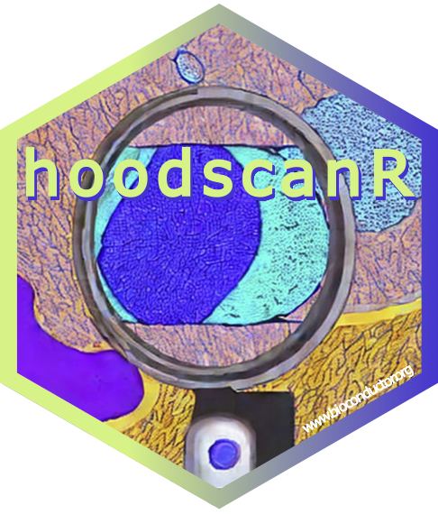

# hoodscanR: Cellular neighborhoods scanning from spatial transcriptomics data in R 

Install released version from Bioconductor

    if (!require("BiocManager", quietly = TRUE))
        install.packages("BiocManager")

    BiocManager::install("hoodscanR")

Install development version from GitHub

    library(devtools)
    devtools::install_github("DavisLaboratory/hoodscanR")
